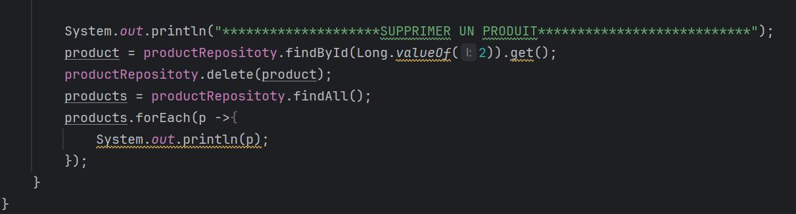

<h3>JPA and Hibernate</h3>

<h6>Question 3 : creation de l'entité "product"</h6>

<h6>Question 4 : configurer l'unité de persistance</h6>

<h6>Question 5 : creation de l'interface "ProductRepository"</h6>

<h6>Question 6 : operations avec "ProductRepository" - JPA</h6>

