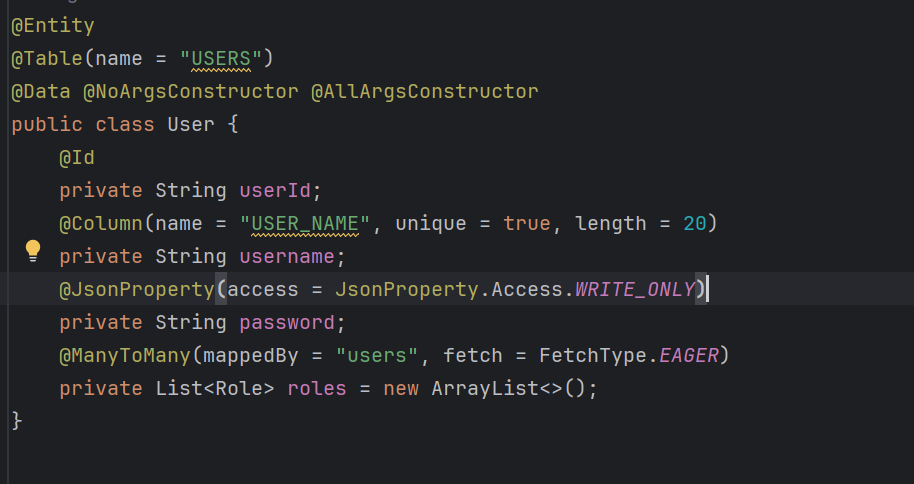
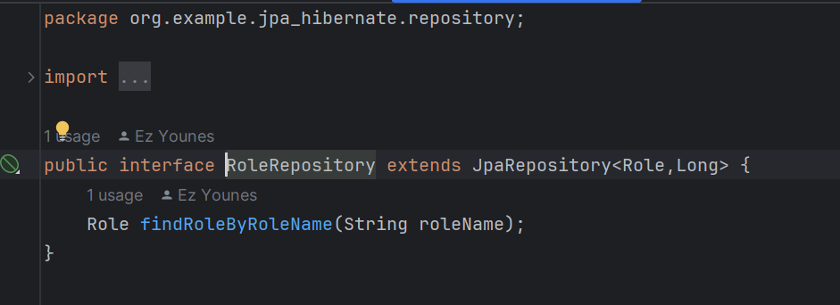
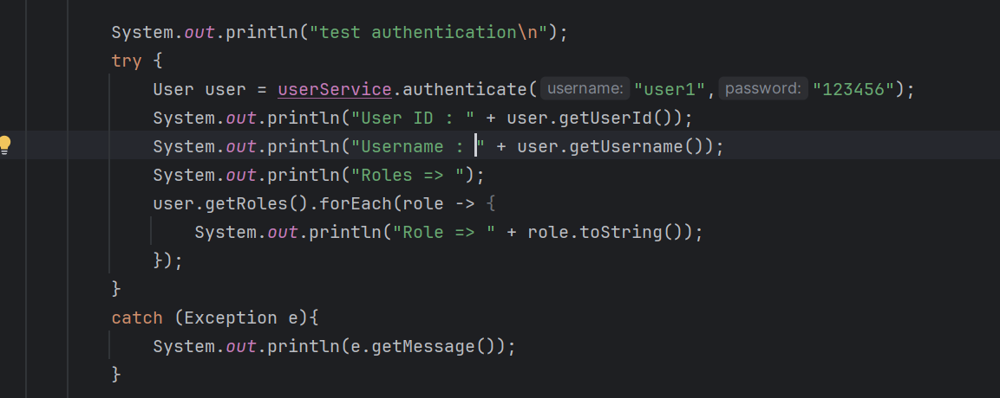
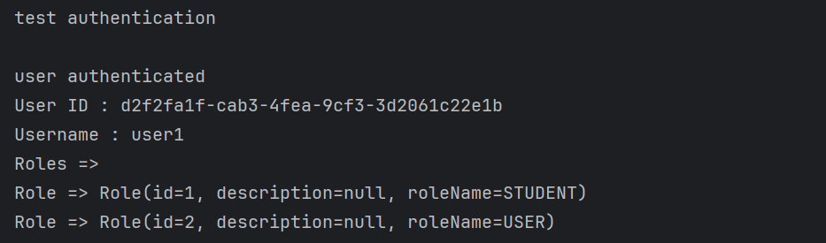

<h2>JPA and Hibernate</h2>

<h4>Question 3 : creation de l'entité "product"</h4>

<h6>Table Product</h6>

<h4>Question 4 : configurer l'unité de persistance</h4>

<h4>Question 5 : creation de l'interface "ProductRepository"</h4>

<h4>Question 6 : operations avec "ProductRepository" - JPA</h4>

<h4>Question 7 : Migration verz MySQL</h4> 

<h4>Question 8 : exemples de patient, medecin, rendez vous, consultation, user, role </h4>

<h5>Exemple Patient</h5>
<h6>Entity patient</h6>

<h6>Patient repository</h6>

<h6>Patient operations</h6>

<h6>Table Patient</h6>

<h5>Exemple Medecin</h5>
<h6>Entity medecin</h6>

<h6>Medecin repository</h6>

<h6>Medecin operations</h6>

<h6>Medecin Table</h6>

<h5>Exemple Rendez-vous</h5>
<h6>Entity RendezVous</h6>

<h6>RendezVous repository</h6>

<h6>RendezVous operations</h6>

<h6>RendezVous Table</h6>

<h5>Exemple Consultation</h5>
<h6>Entity Consultation</h6>

<h6>Consultation repository</h6>

<h6>Consultation operations</h6>

<h6>Consultation Table</h6>

<h5>Exemple User et Roles</h5>
<h6>Entity User</h6>

<h6>Entity Role</h6>

<h6>User repository</h6>

<h6>Role repository</h6>

<h6>User and Role Creation</h6>

<h6>Users Table</h6>

<h6>Role Table</h6>

<h6>Add User to Role</h6>

<h6>RoleUsers Table</h6>

<h6>User Authentication</h6>

<h6>Test Authentication</h6>

